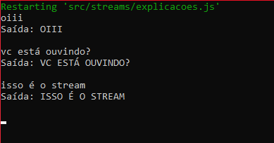
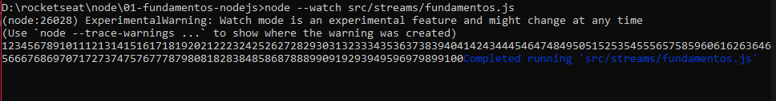

## Anotações

Aplicações:

- Steteful: informações guardadas em memória, se encerrar o servidor, perde-se os dados
- Stateless: guarda as informações em dispositivos externos (banco de dados), se encerrar o servidor, os dados permanecem armazenados

- Header: (Metadados) => Content-type: tipo de conteudo

### Streams

Processo síncrono de entrada e registro de dados (não existe necessidade de subir os dados para leitura para apenas depois realizar o registro).

- stream de entrada: stdin
- stream de saída: stdout

Com funções de encaminhamento, podemos brincar com a funcionalidade de streams
encaminhando os dados de entrada para a saída nas duas funções

```js
process.stdin.pipe(process.stdout);
```

```js
process.stdin.on("data", (data) => {
  data = data.toString().toUpperCase();
  process.stdout.write("Saída: " + data + "\n");
});
```



- \_read(): Método que retorna a stream

Deve mandar os dados em formato buffer quando utilizar o método push
Buffer aceita apenas string para escrever

```js
import { Readable } from "stream";

class UmParaCemStream extends Readable {
  index = 1;

  _read() {
    const i = this.index++;
    if (i > 100) {
      this.push(null);
    } else {
      const buf = Buffer.from(String(i));
      this.push(buf);
    }
  }
}

new UmParaCemStream().pipe(process.stdout); //<-encaminhar os dados criados na classe para a saída
```



### Métodos stream

- \_read
- \_write
- \_transform
- \_duplex(\_read, \_write): pouco usado
