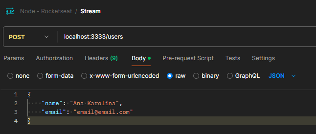

## Anotações

Aplicações:

- Steteful: informações guardadas em memória, se encerrar o servidor, perde-se os dados
- Stateless: guarda as informações em dispositivos externos (banco de dados), se encerrar o servidor, os dados permanecem armazenados

- Header: (Metadados) => Content-type: tipo de conteudo

### Streams

Processo assíncrono de entrada e registro de dados (não existe necessidade de subir os dados para leitura para apenas depois realizar o registro).
--definição rocketseat: Mecanismos para ler e escrever dados de forma assíncrona, controlada e em partes

- stream de entrada: stdin
- stream de saída: stdout

Com funções de encaminhamento (pipe), podemos encaminhar os dados provindos de uma stream para outra

```js
process.stdin.pipe(process.stdout);
```

```js
process.stdin.on("data", (data) => {
  data = data.toString().toUpperCase();
  process.stdout.write("Saída: " + data + "\n");
});
```


- \_read(): Método que retorna a stream

Deve mandar os dados em formato buffer quando utilizar o método push
Buffer aceita apenas string para escrever

```js
import { Readable } from "stream";

class UmParaCemStream extends Readable {
  index = 1;

  _read() {
    const i = this.index++;
    if (i > 100) {
      this.push(null);
    } else {
      const buf = Buffer.from(String(i));
      this.push(buf);
    }
  }
} //from é o método usado para criar um buffer a partir de uma string no node

new UmParaCemStream().pipe(process.stdout); //<-encaminhar os dados criados na classe para a saída
```


### Métodos stream

- \_read
- \_write
- \_transform
- \_duplex(\_read, \_write): pouco usado

### Aplicação stream

O arquivo streamHttpServer simula o servidor que recebe e transforma o dado em tempo real e o fakeUploadHttpStream uma requisição de envio de dados para o servidor em streamHttpServer

Os arquivos cópias de servidor e chamadaDeServidor servem para simular uma stream que o processamento dos dados não deverá ocorrer em picotes, mas após receber todos os dados


#### Buffer

Tipo de dado para trabalhar dentro do node, daria para definir como o jeito de transformar dados em binários(baixo nível) para facilitar o trabalho com trânsito de dados dentro do node.
--definição rocketseat: Estruturas de dados que representa informações binárias

### Requisição

Esse trecho de código processa os dados da requisição vindos como binários

```js
const buffers = [];
for await (const chunk of req) {
  buffers.push(chunk);
}
```

--definição rocketseat-> Chunks: Pedaços de dados que são lidos e escritos em uma stream de forma assíncrona
Se printar chuck, vai aparecer assim no terminal:

```bash
Restarting 'src/server.js'
<Buffer 7b 0d 0a 20 20 20 20 22 6e 61 6d 65 22 3a 20 22 41 6e 61 20 4b 61 72 6f 6c 69 6e 61 22 2c 0d 0a 20 20 20 20 22 65 6d 61 69 6c 22 3a 20 22 65 6d 61 69 ... 15 more bytes>
```

Então, converte os dados binários para string e depois para json

```js
const bufferToJson = Buffer.concat(buffers).toString();
console.log(JSON.parse(bufferToJson)); //os dados que vieram na requisição
```

Joga a função de transformação dentro de um try/catch, pois, caso a requisição seja feita para leitura, não existirá dados para transformar, quebrando a aplicação

```bash
Error: SyntaxError: Unexpected end of JSON input
```




### Database

#### Hard Code

**Arquivo database**

- Para inserir, verifica se o valor existe, se existe insere o novo valor, senão, cria a chave e insere o valor
- Para buscar, verifica se o valor existe, senão envia um array vazio.
- '#' privar a variavel do arquivo

```js
export class Database {
  #database = {};
}
```

_import fs from "fs/promises";_

- função writeFile para escrever em um arquivo: writeFile(nome_do_arquivo, estrutura_de_dado);
- função readFile para ler dados de um arquivo: readFile(endereco_do_arquivo, tipo_de_codificação('utf-8', 'utf-16', ...));

A função de leitura _select(tabela)_ recebe o nome da tabela (chave do objeto) e retorna o valor desse.

A função de escrita _insert(tabela, dados)_ verifica se existe o valor do objeto, caso exista, lê o valor da chave, senão, cria a chave do objeto e e insere o valor como array de objetos.
