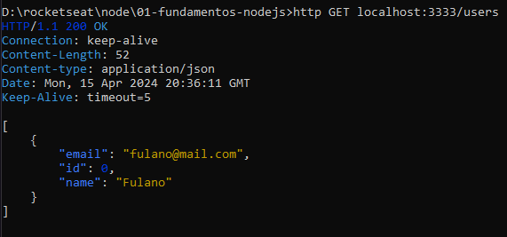

# Registros do curso de node da rocketseat

## Ferramenta de visualização

- httPie

## Anotações

Aplicações:

- Steteful: informações guardadas em memória, se encerrar o servidor, perde-se os dados
- Stateless: guarda as informações em dispositivos externos (banco de dados), se encerrar o servidor, os dados permanecem armazenados

- Header: (Metadados) => Content-type: tipo de conteudo
